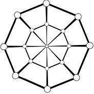
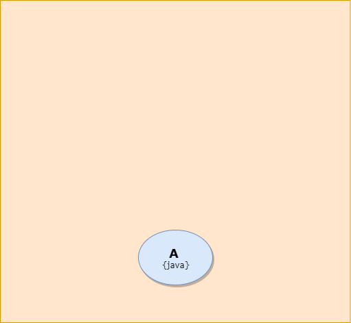
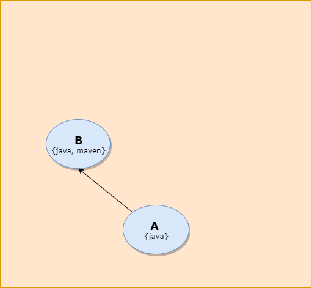
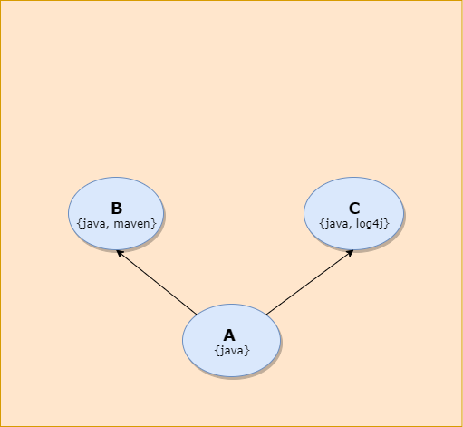
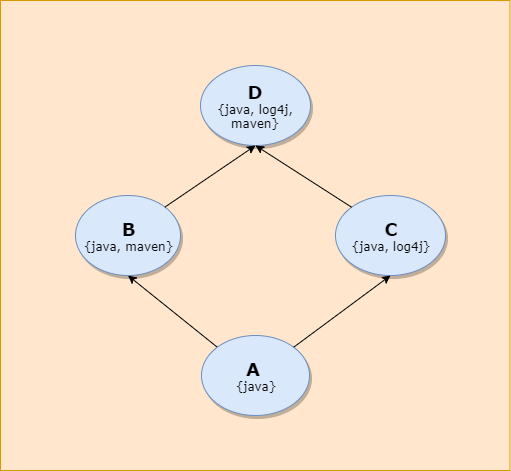

# *[Проект Soft Spiders](https://github.com/softspider)*

<p align="center">
  <a href="https://github.com/softspider">
    
  </a>
</p>

## Оглавление
1. [Предназначение](#предназначение) 
    1. [Долина смерти программных проектов](#долина-смерти-программных-проектов)
        1. [В чём проблема](#в-чём-проблема-)
        2. [Cтоит ли овчинка выделки](#стоит-ли-овчинка-выделки)
    1. [Стартеры](#стартеры)
    2. [Быстрое прототипирование прототипов](#Быстрое-прототипирование-прототипов)
    3. [Классификатор *Soft Spiders*](#классификатор-softspiders)
    4. [Прототипы *Soft Spiders*](#прототипы-softspiders)
    5. [Классификатор программных решений](#классификатор-программных-решений)
    6. [Сопутствующие задачи](#сопутствующие-задачи)
2. [Принципы организации *Soft Spiders*](#принципы-организации-softspiders)
    1. [С чего начинается разработка](#с-чего-начинается-разработка) 
    2. [Зачем нужна минималистичность](#зачем-нужна-минималистичность) 
    3. [Иерархия минималистичных прототипов](#иерархия-минималистичных-прототипов) 
3. [Иерархия прототипов](#иерархия-прототипов)
    1. [*Свойства* и *теги*](#свойства-и-теги) 
    2. [DAG-иерархия](#dag-иерархия) 
    3. [Если кратко](#если-кратко) 
    4. [Пример](#пример) 
    5. [Текущая реализация](#текущая-реализация) 
4. [Базовые сценарии](#базовые-сценарии)
    1. [Поиск прототипа](#поиск-прототипа) 
    2. [Создание прототипа](#создание-прототипа) 
    3. [Декомпозиция сложного прототипа](#декомпозиция-сложного-прототипа) 
    4. [Создание тега-свойства](#создание-тега-свойства) 
5. [FAQ](#faq)
    1. [Какие проблемы решает *Soft Spiders*?](#какие-проблемы-решает-softspiders-) 
    2. [Зачем нужны прототипы?](#зачем-нужны-прототипы-) 
    3. [Почему недостаточно библиотек?](#почему-недостаточно-библиотек-) 
    4. [Сохраняется ли авторство у разработчиков прототипов ?](#сохраняется-ли-авторство-у-разработчиков-прототипов-) 
    5. [На каких технологиях реализован проект ?](#на-каких-технологиях-реализован-проект-) 
    6. [Предполагается ли платное использование сервиса ?](#предполагается-ли-платное-использование-сервиса-) 
    7. [Что делать, если у зависимостей изменяются версии ?](#что-делать-если-у-зависимостей-изменяются-версии-) 
6. [Словарь используемых тегов](#словарь-используемых-тегов)
    1. [Правила именования тегов](#правила-именования-тегов) 
    2. [Теги-синонимы](#теги---синонимы) 
    3. [Зависимости тегов](#зависимости-тегов) 
    4. [Эффективные наборы тегов](#эффективные-наборы-тегов) 
    5. [Пояснения к тегам](#пояснения-к-тегам) 
7. [Текущее состояние проекта](#текущее-состояние-проекта)
    1. [Эволюция и перспективы проекта](#эволюция-и-перспективы-проекта) 
    2. [Что нужно прямо сейчас](#что-нужно-прямо-сейчас) 
    3. [Что потребуется в ближайшее время](#что-потребуется-в-ближайшее-время) 
8. [Приложения](#приложения)
    1. [Правила разработки прототипа](#правила-разработки-прототипа) 
    2. [Правила оформления README](#правила-оформления-readme) 

---

# Предназначение 

Проект *[Soft Spiders](https://github.com/softspider)* создаётся разработчиками для разработчиков. Его главная задача
состоит в подготовке инструментальной базы, необходимой для обеспечения удобного и безболезненного запуска новых
программных проектов.    

В основе *Soft Spiders* лежит **классификатор программных решений**, используемых для разработки в качестве средств
быстрого прототипирования и для обучения - в качестве примеров кода, демонструющих различные шаблоны проектирования,
лучшие практики и т.п.

## Долина смерти программных проектов

Профессиональная жизнь программиста складывается из разных периодов и видов работ, среди которых особую роль играют те,
что связаны со стартом новых проектов.
    
Новый проект это хоть в чём-то, но всегда новая жизнь. Даже в обстановке рабочей рутины он может стать точкой
профессионального роста, особенно, если такая цель ставится самим разработчиком.

Но никакое начинание не обходится без хотя бы некоторого преодоления себя, без выхода, как сегодня принято говорить, из
зоны комфорта. Проблема старта стара, как мир, и в запусках программных проектов она проявляет себя в самой полной мере.

С течением времени трудности запуска любого на что-то претендующего проекта постоянно возрастают. И в совокупности они
создают серьёзную проблему стартового периода, который без особых преувеличений можно считать долиной смерти программных
проектов.


Образ долины смерти для программистов не нов, чаще всего его ассоциируют со стартапами, где проблемы старта проявляются
наиболее драматичным образом, поскольку в каждом случае от их преодоления напрямую зависит выживание какого-то
бизнес-проекта.  

Тем не менее проблемы эти общие, они также присутствуют и в личных, и в корпоративных проектах.

### В чём проблема ?

Проблема не одна, их множество и причины у них разные. Какие-то имеют субъективный, какие-то - объективный характер.  

Перечислим кратко наиболее очевидные.

#### Человеческое

Желание сделать что-то новое часто очень быстро угасает, когда разработчик сталкивается, может быть даже только в своём
воображении, с перспективой долгого и трудного старта, с пониманием, что только для того, чтобы новая программа просто
как-то начала работать, придётся потратить уйму времени и сил на изучение множества разных, часто не слишком интересных
материалов и мелких деталей. К тому же если знание большей части из этих деталей в итоге может оказаться ненужным хотя
бы из-за изменений набора используемых инструментов, что на старте проекта является обычным делом.

#### Объективное

Помимо субъективно-психологических трудностей старта, существуют и объективные, они разные.  

##### Боль которая мешает

В любой работе присутствуют ошибки, они такая же данность, как боль в жизни организма. Но эта боль мешает двигаться
вперёд. И дело в том, что ошибки, совершающиеся на самом старте, когда проект доводится до минимально рабочего
состояния, выявляются гораздо труднее, чем те, что делаются на стабильной фазе разработки.

##### Опережающий рост проблем старта

Проблемы старта во многом связаны с тем, что постоянное развитие технологий приводит к постоянному росту требований,
предъявляемых к программным продуктам.

Пару-тройку десятков лет назад для того, чтобы функционально полезный программный продукт, к примеру личный календарь,
был на ура принят пользователями, было достаточно выпустить его дистрибутив для десктопа на доступных для того времени
носителях (дискеты, CD, DVD).    

А сегодня для того, чтобы всё тот же календарь получил шансы "взлететь", от него требуется намного больше: он должен
быть доступен в режиме 24/7, но самое главное - везде: на работе, дома, в отпуске, в любом транспорте.     

Чтобы этого достичь, продукт должен быть реализован сразу для нескольких платформ: для всех популярных мобильных и
десктопных браузеров, иногда в виде их расширений, для смартфонов разных моделей и операционных систем, а в каких-то
случаях и в качестве нативных десктоп-приложений, хотя как раз этот вариант сейчас становится всё менее востребованным.  

При этом справедливости ради, конечно, надо признать, что средства разработки программ также постоянно совершенствуются,
развитие технологий их не обходит. И сегодня "при прочих равных" производить программный код существенно проще, чем
раньше. 

Но разработчики со стажем, те, что видели дискеты или даже перфокарты, ощущая тенденции на себе, могут сравнить времена
и сделать очевидный вывод: при всех несомненных достижениях в сфере разработки программ проблемы старта растут всё ещё
опережающими темпами, из-за чего путь через долину смерти программных проектов становится пока только длиннее.

### Стоит ли овчинка выделки

Решение проблем стартового периода становится всё более востребованным. Нужны подходы, технологии, инструменты,
позволяющие преодолевать этот период максимально быстро, безопасно, с наименьшими затратами, чтобы сохранить необходимые
силы и мотивацию для дальнейшей работы уже на других, гораздо более стабильных, периодах существования проекта.

#### Принцип минимальной достаточности 

На этапе становления проекта особенно важно правильно распределить вложение сил и средств.
Чем на более раннем этапе находится разработка, тем больше риск потерпеть неудачу, соответственно, потеряв всё то, что в
эту разработку было вложено.

Известным подходом к снижению рисков, о котором часто упоминается в рассказах о стартапах, является разделение
разработки на этапы по схеме: *проверка концепции* - *Proof of Concept (PoC)*, создание *прототипа*, получение
*минимально жизнеспособного продукта* - *Minimum Viable Product (MVP)*.    
Это примерная схема, в каждом конкретном случае она может уточняться, какие-то этапы могут разбиваться на подэтапы,
какие-то - пропускаться.  

Но каждый раз действует правило **минимально достаточного вложения**, при котором затраты на разработку должны быть
соразмерны задаче каждого этапа, но не более того.

#### Проверка концепции

На этом этапе разработчик испытывает главную идею проекта. Пользуясь наиболее доступными и удобными для себя средствами,
он проверяет, стоит ли проектом заниматься в принципе.          
Например, он может проверить производительность и ресурсозатратность ключевых алгоритмов. А может просто спросить совета
у человека, мнению которого доверяет.  

Так что действия при проверке концепции могут быть самыми разными, и они практически не поддаются формализации.

#### Прототип

Прототип создаётся для того, чтобы продемонстрировать идею и приципиальную возможность её реализации какому-то обычно
не очень широкому кругу заинтересованных лиц, от которых может зависеть судьба проекта.    
К таким лицам могут относиться потенциальные участники разработки, спонсоры, инвесторы, а если проект предполагается
вести в рамках существующей компании, то кто-то из руководителей - из тех, кто "даёт добро".

#### Минимально жизнеспособный продукт 

Проверка минимальной жизнеспособности продукта производится в реальной среде, когда он выносится на суд пользователей -
тех, для кого он в конечном счёте предназначен.  
Если продукт коммерческий, оценивается пользовательский спрос и, как минимум, возможность самоокупаемости.    
Если продукт корпоративный, в первую очередь проверяется то, насколько он поддерживает или улучшает бизнес-процессы
компании, и то, как он принимается её сотрудниками. 
 
## Стартеры

***Стартерами** называются небольшие, заведомо работоспособные, лёгкие в установке и запуске проекты, предназначенные
для использования в качестве основы для новых разработок*.

В любой разработке присутствуют ошибки, без ни не бывает. Это данность, как боль в жизни организма. Но боль, которая
мешает двигаться вперёд, и которую необходимо минимизировать.    
И дело в том, что ошибки, совершающиеся на этапе доведения проекта до минимально рабочего состояния - на том самом пути
по "долине смерти" - выявляются гораздо труднее, чем ошибки, которые делаются на уже работающем проекте, когда потеря
работоспособности программы становится почти сразу видна, особенно, если в ней присутствуют автотесты.

Стартеры это как раз такие "уже работающие проекты", минимизирующие которые не только .

Для того, чтобы с ними было удобно работать, стартеры должны иметь чётко определённый набор свойств.

### Доброе начало - половина дела

От проекта, берущегося за основу, зависят скорость и качество не только старта, но и всего последующего хода разработки.    
Например, стартер с автотестами стимулирует разработчиков писать автотесты, скрипты сборки стартера предполагают
использование соответствующих инструментов, заложенные в стартере шаблоны проектирования - использование в проекте
соответствующих архитектурных решений и т.д.

### Виды стартеров

Хороший прототип задаёт новой разработке правильную организацию и направление. 

Например, наличие автотестов, дизайн-системы, организация файловой системы, скрипты сборки, проверки качества кода и
многое другое.
TBD

#### Технологические стартеры

библиотеки, фреймворки
TBD

#### Архитектурные стартеры

Шаблоны проектирования
Dependency Injection, Inversion Of Control, 

Архиктурные подходы
- реактивность
- MVC, MVP, MVVM, ...

TBD

#### Скорость
 
#### Качество

#### Организация файловой системы

TBD

#### Автотесты

TBD

### [Дизайн-системы](https://habr.com/ru/company/mailru/blog/351726/)

TBD


### Зачем нужны стартеры ?

При всех плюсах реальный работающий проект, взятый в качестве основы для нового проекта имеет недостатки...


TBD

### Разгонные блоки

TBD


#### PoC, прототипы, MVP

чтобы можно было убедиться в её значимости, убедительности для заказчиков и, может быть, потенциальных инвесторов, смысле дальнейшей разработки.   

Мало что бывает хуже падающей демы. Производит неизгладимо отрицательное впечатление.
"Быстро проверить идею". 
Для некоторых проектов, когда важным заказчикам или потенциальным инвесторам нужно продемонстрировать рабо критерием успеха служит быстрый старт
"Не спугнуть идею", 

***Почему оно так важно ? TBD*** 

Поиск качественного прототипа - программного решения, которое можно было бы использовать в качестве основы для новой
разработки является непростой задачей, причём она далеко не всегда завершается успехом.  

Чем больше свойств, которыми прототип должен обладать, тем больше его сложность и тем меньше шансов его найти в готовом
для использования виде.

Сегодня для разработчика, который ищет подходящую основу для начала разработки, почти все пути ведут в
[GitHub](https://github.com/), с появлением которого задача нахождения программного кода с нужными свойствами
значительно упростилась.    
Но и в этом случае вся совокупность необходимых действий: работа с поисковиком, проверка качества исходников и
работоспособности программ до сих пор требует немалых навыков и усилий, которые к тому же очень часто оказываются
неблагодарными.

Главная задача проекта *Soft Spiders* заключается в попытке решения этой проблемы.  

## Быстрое прототипирование прототипов 

### Быстрое прототипирование

Предназначение *Soft Spiders* во многом состоит в том, чтобы хорошие прототипы можно было легко находить, сравнивать,
выбирать и использовать по назначению, ускоряя и удешевляя создание разнообразных программных продуктов.  
И с этой точки зрения *Soft Spiders* можно формально позиционировать как **средство быстрого прототипирования**.

### Прототипирование прототипов 

Но в отличие от многих других средств прототипирования *Soft Spiders* характерен тем, что его главной задачей является не
столько генерация готовых программ (хотя она тоже может решаться), сколько систематизация уже существующих прототипов и -
на преемственной основе - **упрощение процесса создания самих прототипов**, что делает его своеобразным ***средством
прототипирования прототипов***.

Основой систематизации прототипов служит классификатор *Soft Spiders*. 

## Классификатор *Soft Spiders*

Для лучшего понимания механизмов организации классификатора *Soft Spiders*, сразу стоит отметить, что его содержательными
единицами (далее по тексту - элементами) не обязательно должны быть прототипы.

### Не обязательно прототипы

*Элементом классификатора *Soft Spiders* может быть любой набор текстовых файлов, если этому набору можно сопоставить
какое-то подмножество из **общего множества свойств**.*

Например, элементами классификатора могут быть:

- шаблоны текстовых документов
- кулинарные рецепты (ингредиенты могут выступать свойствами)
- заготовки учебных (и других) планов
- заготовки различных сценариев
- ...

**Общее множество свойств** является систематизирующей основой классификатора. Оно определяет границы, в которых будут
существовать его содержательные элементы.

Но при всех имеющихся возможностях классифицировать разное сам проект *Soft Spiders* ориентирован прежде всего на
систематизацию *программных прототипов*, на создание сервисов, упрощающих жизнь разработчиков программ.

## Прототипы *Soft Spiders*

Какие виды прототипов поддерживает проект ?

### Программные прототипы

В *Soft Spiders* предполагается поддежка следующих видов программных прототипов:

- проекты-стартеры
- шаблоны (исходники для разнообразных генераторов)
- образовательные проекты - проекты, используемые для обучения/самообучения
- архитектурные решения (шаблоны проектирования, ...)
- алгоритмы
- конфигурации (Webpack, pom, package.json, Travis CI, Docker, ...)
- раскладки (layout) экранов пользовательского интерфейса
- ...

## Классификатор программных решений

Классификатор *Soft Spiders* организован как иерархия прототипов, которая снабжена средствами создания, поиска и
навигации по иерархии прототипов.

Ниже по тексту иерархию *Soft Spiders* будем сокращённо называть ***SS-иерархией***, а прототипы *Soft Spiders* -
***SS-прототипами***.

Предполагается, что эта база должна охватывать все виды программной разработки без каких бы то ни было ограничений.

## Сопутствующие задачи 

Среди задач, которые призван решать *Soft Spiders*, можно выделить ещё, как минимум, те, что направлены на обеспечение
обмена опытом между разработчиками: 
- помощь при самообучении
- фиксация результатов самообучения или результатов разработки в виде новых проектов
- передача знаний при обучении (иерархия качественных программных проектов представляет собой практически готовый
учебный материал)

---

# Принципы организации *Soft Spiders*

Далее о том, почему содержание *Soft Spiders* составляют минималистичные программные проекты и о принципах организации
классификатора.
 
## С чего начинается разработка

С появлением поисковиков и открытых программных репозиториев начало нового проекта всё чаще начинается с поиска готовой
и наиболее подходящей работающей программы-прототипа, которую можно было бы взять в качестве основы для дальнейшей
разработки.           

Для того, чтобы прототип наилучшим образом подходил в качестве такой основы, в нём не должно быть ничего лишнего -
только необходимое.  

## Зачем нужна минималистичность

Важным и очень желательным свойством прототипа является его ***минималистичность***, поскольку она гарантирует прототипу
сбалансированное (потому что минимальное) присутствие в нём всех его свойств, упрощает пользователям-разработчикам
знакомство с этим прототипом, упрощает его сравнение с родственными прототипами, в том числе при помощи
diff-инструментов, особенно, если родственные прототипы также минималистичны.

Но особенно важным для *Soft Spiders* свойством минималистичности прототипов является **возможность** их **строгой
классификации**.    
Если от противного: чем более программный код многословен, тем больше размываются его свойства, тем труднее его
классифицировать.

## Иерархия минималистичных прототипов

В основе *Soft Spiders* лежит классификатор (далее по тексту - *SS-классификатор*), элементами которого являются
прототипы программ.

При множественном наследовании SS-иерархия может иметь множество корней. В корнях этой иерархии  лежат простейшие
программы, являющиеся hello-world-программами в самом обычном смысле этого слова: hello-world на Java, hello-world на
JavaScript, и т.д.    
На следующих уровнях иерархии находятся хоть и более сложные, но, если их рассматривать в контексте свойств своих
предков, тоже минималистичные программы.

Каждый дочерний проект-прототип добавляет к родительскому прототипу в общем случае несколько новых свойств (в идеале -
одно), например, логирование, сборку,  тестирование, и т.п. Этот дочерний прототип, в свою очередь, становится
родительским для других новых прототипов. И так далее.
  
Таким образом в результате выстраивается ***иерархия минималистичных прототипов с поддержкой множественного наследования
свойств***
([DAG](https://ru.wikipedia.org/wiki/%D0%9E%D1%80%D0%B8%D0%B5%D0%BD%D1%82%D0%B8%D1%80%D0%BE%D0%B2%D0%B0%D0%BD%D0%BD%D1%8B%D0%B9_%D0%B0%D1%86%D0%B8%D0%BA%D0%BB%D0%B8%D1%87%D0%B5%D1%81%D0%BA%D0%B8%D0%B9_%D0%B3%D1%80%D0%B0%D1%84)-иерархия).

---

# Иерархия прототипов

SS-иерархия выглядит примерно так же, как иерархия классов или интерфейсов в ООП, с поддержкой множественного
наследования.

## *Свойства* и *теги*

Ключевым понятием SS-классификатора является понятие *свойства*.

В *Soft Spiders* поддерживается расширяемый стандартизованный перечень ***свойств***.
Каждое *свойство*, как правило, определяет некоторую функциональность - то, для чего на английском обычно используется
термин *feature*.

Каждому свойству ставится в соответствие уникальный ***тег*** (или множество *тегов-синонимов*), идентифицирующий
это свойство.

В контексте *Soft Spiders* понятия *тег* и *свойство* часто взаимозаменяемы. Но есть разница.  
В отличие от именования тегов для именования свойств не существует каких-то строгих правил - могут использоваться разные
языки, алфавиты, и т.п.

## DAG-иерархия

Каждый SS-прототип имеет какой-то определённый набор свойств и помечается соответствующим набором тегов.

Поскольку не все наборы свойств могут быть сравнимы между собой, то SS-прототипы образуют
[*частично-упорядоченное множество*](https://ru.wikipedia.org/wiki/%D0%A7%D0%B0%D1%81%D1%82%D0%B8%D1%87%D0%BD%D0%BE_%D1%83%D0%BF%D0%BE%D1%80%D1%8F%D0%B4%D0%BE%D1%87%D0%B5%D0%BD%D0%BD%D0%BE%D0%B5_%D0%BC%D0%BD%D0%BE%D0%B6%D0%B5%D1%81%D1%82%D0%B2%D0%BE),
или [DAG](https://ru.wikipedia.org/wiki/%D0%9E%D1%80%D0%B8%D0%B5%D0%BD%D1%82%D0%B8%D1%80%D0%BE%D0%B2%D0%B0%D0%BD%D0%BD%D1%8B%D0%B9_%D0%B0%D1%86%D0%B8%D0%BA%D0%BB%D0%B8%D1%87%D0%B5%D1%81%D0%BA%D0%B8%D0%B9_%D0%B3%D1%80%D0%B0%D1%84)-иерархию.

## Если кратко

*Каждый SS-прототип помечается соответствующим ему набором тегов. Поэтому иерархия SS-прототипов фактически является
иерархией наборов тегов*.

## Пример

Лучше один раз увидеть, чем сто раз услышать.

Рассмотрим простой пример, иллюстрирующий возникновение отношений родитель-потомок между прототипами, в котором также
показывается образование иерархии с множественным наследованием свойств.

Пусть прототип **A** представлен hello-world-программой на Java. Поскольку других свойств прототип **A** не имеет, то он
помечается только тегом *java* (набором тегов *{java}*):  

<p align="center"> 

</p>

Пусть прототип **B** отличается от прототипа **A** только тем, что он реализован по стандартам *Maven*. В соответствии с
этим он помечается набором тегов *{java, maven}*:

<p align="center"> 

</p>

Поскольку множество тегов прототипа **A** (*{java}*) принадлежит множеству тегов прототипа **B** (*{java, maven}*),
прототип **B** является потомком прототипа **A**.

По-другому можно сказать, что прототип *B* функционально расширяет прототип *A*, поскольку имеет более полный набор
свойств.

Пусть ещё один прототип **C** отличается от прототипа **A** только тем, что вывод сообщений выполняется в нём с помощью
библиотеки *log4j*, и в соответствии с этим он помечается набором тегов *{java, log4j}*:

<p align="center"> 

</p>

Поскольку множество тегов прототипа **A** (*{java}*) принадлежит множеству тегов прототипа **C** (*{java, log4j}*),
прототип **C** также, как и **B**, является потомком прототипа **A**.

Пусть реализован ещё один hello-world-прототип на Java, назовём его **D**.  
Пусть он так же, как **B**, организован по стандарту
*Maven* и, так же, как **C**, выводит сообщения с помощью библиотеки *log4j*.  
Тогда в соответствии со своим набором свойств прототип **D** помечается набором тегов *{java, log4j, maven}* и согласно
вышеуказанным правилам наследования будет одновременно являться непосредственным потомком как прототипа **B**, так и
прототипа **C**.

<p align="center"> 

</p>


В результате прототипы **A**, **B**, **C** и **D** образуют небольшую DAG-иерархию, в которой прототип **D** является
множественным наследником свойств прототипов **B** и **C**.

## Текущая реализация

На данный момент SS-иерархия предварительно реализована при помощи http-ссылок, размещающихся в файлах *README.md*
соответствующих git-репозиториев.  

По факту все git-репозитории находятся на *GitHub*. Пока это рекомендуемая практика, хотя она и не является обязательной. 

---

# Базовые сценарии

Рассмотрим базовые сценарии работы с прототипами. К ним относятся:
- Поиск прототипа
- Создание прототипа
- Декомпозиция сложного прототипа
- Создание свойства

### Поиск прототипа

Поиск нужного прототипа происходит путём комбинирования фильтрации по тегам и дальнейшей навигации по SS-иерархии.

Замечание: в текущей предварительной реализации используется нестрогая фильтрация на основе тегов GitHub.

#### Фильтрация по тегам

SS-иерархия обеспечивает возможность фильтрации прототипов с помощью тегов, что позволяет, варьируя наборы тегов-свойств,
оперативно изучать пространство имеющихся прототипов, после чего делать на этой основе быстрый и качественный выбор. 

#### Навигация по SS-иерархии

При навигации по SS-иерархии пользователь переходит по иерархическим связям с одного прототипа на другой, имея при этом
возможность подробного просмотра свойств, параметров, исходного кода и других деталей каждого из прототипов.
 
При навигации по иерархии предполагается, что в каждый момент времени пользователь находится на каком-то одном из её
узлов. При этом в общем случае пользователь имеет возможность перейти или на один из узлов потомков, или на один из
родительских узлов. 

В целевой реализации навигация по SS-иерархии предполагает поддержку со стороны соответствующей клиентской программы.    
Но в сегодняшней предварительной реализации навигация выполняется при помощи браузера посредством переходов по
http-ссылкам Readme-документов прототипов, размещённых на GitHub. 

### Создание прототипа

Создание прототипа предполагает следующие этапы:

1. Создание для прототипа git-репозитория (на данный момент рекомендуется использовать GitHub)
2. Разработка прототипа в созданном репозитории согласно несложным [правилам](#правила-разработки-прототипа)
3. Документирование прототипа в файле *README.md* согласно соответствующим
[правилам](#правила-оформления-readme)

### Декомпозиция сложного прототипа

Декомпозиция хорошего сложного прототипа на более простые - самый удобный и лучший способ создания прототипов, поскольку,
во-первых, разбирать проект на части гораздо легче, чем собирать, а во-вторых, в результате декомпозиции можно легко
получить целое семейство проектов, связанных между собой не только общими свойствами, но и **общим кодом**, что даёт
возможность удобо сравнивать код прототипов diff-инструментами.

### Создание тега-свойства

1. Перед тем, как создавать новый тег-свойство, необходимо убедиться, что этот тег отсутствует в
[словаре](#словарь-тегов).  
При этом необходимо понять, действительно ли речь идёт о добавлении нового свойства или требуется добавить просто новый
синоним к одному из существующих тегов-свойств.   
2. После того, как необходимость создания нового тега/синонима подтвердилась, нужно подать заявку на расширение словаря
тегов простым письмом на адрес <sftspider@gmail.com> в письменно-свободной форме (пока так).
3. Дождаться необходимых изменений в [словаре тегов](#словарь-тегов) или отказа с объяснением причин, если заявку
невозможно удовлетворить.  

---

# FAQ

## Какие проблемы решает *Soft Spiders* ?

*Soft Spiders* не решает каких-то фундаментальных проблем, но он упрощает жизнь разработчиков в таких аспектах, как:
- старт новых проектов, предлагая удобные средства поиска качественных прототипов
- создание новых прототипов - во многом за счёт их иерархической организации, что даёт возможность **инкрементальной
разработки** прототипов путём создания новых на основе старых, уже присутствующих в иерархии 
- обучение новым технологиям, предлагая классификатор прототипов как хорошую систематизацию учебных материалов
- фиксацию результатов самообучения/разработки в виде новых прототипов

## Зачем нужны прототипы ?

В первую очередь прототипы нужны для разработки.  

Разработку любого проекта намного проще начать, если взять за основу близкий по функциональности другой, уже работающий
проект. Прототипы *Soft Spiders* как раз и являются такими работающими проектами.

Но помимо помощи разработчику прототипы *Soft Spiders* играют также и образовательную роль (см. выше).

## Почему недостаточно библиотек ?

В мире программирования библиотеки являются неоценимым способом повторного использования программных решений. Но при
этом они всё же не могут удовлетворить всех потребностей, возникающих при разработке. 

По сравнению с библиотеками прототипы предлагают хотя и другой, может быть менее формализованный, но в определённом
смысле, более высокий уровень повторного использования.

### Прототипы предлагают целостные решения

В отличие от библиотек, программные прототипы представлены **работающими программами** и предлагают **целостные
решения**, что приципиально важно.

### Качественные стартеры предлагают хорошие практики
  
В частности, если говорить о библиотеках, прототипы показывают, как именно нужно использовать те или иные библиотеки,
как правильно их конфигурировать, как правильно совмещать версии разных библиотек и т.д. 

## Сохраняется ли авторство у разработчиков прототипов ?

Да, в разделах описания прототипа присутствует поле *Authors*.

## На каких технологиях реализован проект ?

В данный момент SS-иерархия реализована на основе git-репозиториев, размещаемых на *GitHub*. Каждый репозиторий содержит
ровно один SS-прототип. Ирархические отношения прототипов реализованы при помощи http-ссылок, размещаемых в их
readme-документах.

## Предполагается ли платное использование сервиса ?

Сам по себе сервис *SoftSpider* предполагает бесплатное использование.

Существующие на данный момент прототипы разработаны под лицензией MIT и находятся в открытом доступе.

В то же время на разработчиков прототипов в *Soft Spiders* не накладывается каких-либо лицензионных ограничений.  
Прототипы могут разрабатываться под любой лицезией, могут быть приватными (см. ниже), могут распространяться как на
бесплатной, так и на платной основе.

### Приватные прототипы

Определённая категория прототипов может быть закрыта для бесплатного доступа. 
Предполагается, что к таким прототипам доступ будет возможен только обладателями специальных учётных записей. 

Политика доступа к приватным прототипам пока не определена.

#### Открытые ссылки на приватные прототипы

Закрытие репозиториев приватных прототипов не обязательно относится к ссылкам на эти прототипы из других репозиториев.    
Так например, если открытый прототип имеет ссылку на закрытый прототип-потомок, то эта ссылка может оставаться видимой.

## Что делать, если у зависимостей изменяются версии ?

Каждый прототип создаётся на каком-то определённом наборе библиотек, фреймворков и прочих зависимостей, версии которых
так или иначе фиксируются в его исходных конфигурационных файлах (pom.xml, package.json, ...).
Если у зависимостей прототипа появляются новые версии, то необязательно что-то предпринимать, поскольку прототип и на
старых версиях продолжает сохранять своё главное качество - служить основой для других разработок.  
В то же время актуализация прототипа путём поддержки новых версий, конечно, приветствуется. 

В случае, если при появлении новых версий у прототипа появляются новые свойства, возможны дополнительные варианты:
- поддержка новых версий с расширением набора свойств прототипа 
- создание прототипа-потомка, поддерживающего новый расширенный набор свойств   

---

# Словарь используемых тегов

Проект *Soft Spiders* имеет собственный  [**словарь тегов**](SoftSpiderTags.md#словарь-тегов), используемых при разметке
прототипов.
  
Ниже приводятся основные правила организации работы с тегами. 

## Правила именования тегов

При именовании тегов можно использовать только строчные буквы латинского алфавита, знак дефиса и цифры, причём имена
тегов должны начинаться с буквы.

В дальнейшем возможны некоторые из этих правил могут быть ослаблены.  


## Теги - синонимы

В скобках словаря тегов указаны теги-синонимы, которые являются его полноценными элементами.

## Зависимости тегов

Стрелками '->' в *словаре тегов* обозначаются *теги-зависимости*. Использование зависимостей позволяет сокращать
разметку прототипов.    
То есть, если, например есть в словаре тегов есть зависимости

```
jersey -> java, rest
rest -> api, http
``` 

, то наличие в разметке узла SS-иерархии тега *rest* означает одновременное наличие там тегов *api, http*, а наличие
тега *jersey* означает одновременное наличие там тегов *java, rest, api, http*.  
Поэтому вместо подразумеваемого полного - **эффективного набора тегов** (см. ниже) *jersey, java, rest, api, http* можно
и рекомендуется использовать только *jersey*.

##  Эффективные наборы тегов

При построении SS-иерархии учитываются ***эффективные наборы тегов*** - те наборы, которые определяются с учётом всех, в
том числе транзитивных зависимостей.

Граф зависимостей тегов не должен иметь циклов. Поэтому иерархия зависимостей тегов, также как и SS-иерархия, является
DAG-иерархией.

## Пояснения к тегам

Имена некоторых тегов могут требовать расшифровки или пояснения. Для этого в словаре используются двоеточия.

Например, смысл тега *hapi* в контексте *словаря тегов* поясняется таким образом: 

```
hapi -> api, backend, node: небольшой фреймворк, использующийся для разработки web-приложений на NodeJS 
```

Стоит отметить, что здесь поясняется именно *hapi*, а не его теги-зависимости: *api, backend, node*.

## Изменяемость словаря

Словарь тегов *Soft Spiders* является изменяемым, как правило, в сторону расширения. Изменения словаря выполняются
участниками проекта.

---

# Текущее состояние проекта

В настоящее время *Soft Spiders* находится в переходном состоянии от прототипа к MVP.

*Soft Spiders* имеет несколько проектов-стартеров, некоторые из которых уже сейчас используются сторонними разработчиками.
То, что их пока немного, объясняется тем, что до сих пор рост SS-иерархии за редкими исключениями происходил в режиме
proof-of-concept, снизу-вверх, что, разумеется, приводило к преимущественному росту её нижних, базовых уровней.

Программная поддержка, автоматизирующая процессы работы с прототипами планируется, но её пока нет, если к таковой
не относить используемые возможности GitHub: хостинг SS-репозиториев, поисковик GitHub, организацию связей между
прототипами через ссылки README.md и т.п.

## Эволюция и перспективы проекта

Наполнение базы знаний проекта продолжается.  
Очевидно, что чем выше будет уровень  SS-иерархии, тем большим набором
свойств и большей сложностью будут обладать прототипы, тем большей будет стоимость добавления новых свойств, поскольку с
ростом числа используемых инструментов будет расти и стоимость решения проблем их совместимости.
А значит - тем большую ценность решения *Soft Spiders* будут иметь для разработчиков.

## Что нужно прямо сейчас

- Разработка правил для участников проекта - раздела типа
[How to Contribute](https://reactjs.org/docs/how-to-contribute.html), но пока попроще 
- Разработка манифеста проекта

## Что потребуется в ближайшее время

- Разработка json-представления для прототипов
- Сайт проекта (в основе статический), который бы включал, как минимум:
  - Систему навигации по SS-иерархии
- Система мотивации участников
    - геймификация
    - рейтинги разработчиков
    - рейтинги прототипов
    - ...

### Что будет нужно всегда ?

Наполнение базы знаний прототипами - её главным содержанием

---

# Приложения

## Правила разработки прототипа

В целом прототип разрабатывается как обычный проект. Он может быть написан с нуля, может быть fork-ом или копией
другого проекта. В двух последних случаях в README проекта указывается ссылка на оригинальное авторство.

### Английский язык

Поскольку проект *Soft Spiders* ориентирован на привлечение широкого круга участников, в том числе зарубежных, все тексты
репозитория SS-прототипа (код, комментарии в коде, комментарии коммитов, документация прототипа и т.п.) разрабатываются
на английском.

### Главный документ

Главный документ SS-прототипа находится в файле README.md, правила оформления которого описаны
[здесь](#правила-оформления-документа-readmemd-ss-прототипа).


### Автотесты

Крайне желательным свойством прототипа является покрытие его кода автотестами. Впоследствии для отдельных категорий
прототипов наличие автотестов может стать обязательным.  

Потребность в наличии автотестов обусловлена перспективами развития проекта *Soft Spiders*. Чем дальше он будет
развиваться, тем сложнее будут становиться прототипы, тем труднее будет вручную проверять их работоспособность,
особенно, если поток запросов на включение прототипа в SS-классификатор будет большим.

Ну и, разумеется, никто не отменял связь между наличием автотестов и качеством программных проектов. В частности, для 
прототипов-стартеров автотесты всегда являются существенным плюсом.

#### Подключение средств Continuous Integration

Ещё более ценным свойством проекта является *ci* - подключение средств *Continuous Integration* для автоматического
запуска тестов при поступлении изменений (коммитов) в репозиторий проекта.

На GitHub *Continuous Integration* поддерживается средствами [*Travis CI*](https://travis-ci.com/) и
[*GitHub Actions*](https://github.com/features/actions).

## Правила оформления README

Файл *README.md*, находящийся в корневой директории репозитория, является его главным документом.  
Он оформляется в синтаксисе markdown (желательно на диалекте GitHub).

### Разделы главного документа

Ниже перечисляются правила оформления наиболее часто использующихся разделов README в синтаксисе markdown - в том
порядке, в каком они должны следовать в самом документе.

Разделы, названия которых ниже по тексту помечены звёздочками, являются обязательными для указания в README проекта. 


#### Первая строка - принадлежность к *Soft Spiders* *

Признаком принадлежности репозитория к проекту *Soft Spiders* является наличие строки *'SOFTSPIDERS'* в начале первой
строки файла *README.md*, как здесь:

```
SOFTSPIDERS
...
```

#### Название проекта *

Название проекта указывается в заголовоке markdown первого уровня:

```
# rest-api-java-jersey
```

#### Раздел *Feature tags* *

Описывает набор тегов-свойств прототипа, например:

```
## Feature tags

- hooks
- react
- test
```

#### Раздел *Authors* *

В разделе перечисляются авторы прототипа с указанием распределения ролей, если это нужно, например:

```
## Authors

* [Dennis Kortsch](https://github.com/DennisKo) - original code
* [Alexander Lapygin](https://github.com/AlexanderLapygin) - catching in [Soft Spiders Net](https://github.com/softspider)

```

#### Раздел *Inspired by*

При желании автор может перечислить источники, вдохновившие его на создание проекта. Например:

```
## Inspired by

[An Apollo Server & Client in a yarn Workspace deployed with Zeit 2.0](https://github.com/DennisKo/zeit-now-next-apollo-typescript-example)
```


#### Раздел *Direct ancestors*

В разделе перечисляются, если они есть, ссылки на непосредственные проекты-предки SS-иерархии. Например:

```
## Direct ancestors

- [Minimal Next in TypeScript](https://github.com/softspider/next-typescript)
- [Zeit Now "HelloWorld" example](https://github.com/softspider/now)
```

Если у проекта нет предков, раздел не включается в документ.

#### Раздел *Direct descendants*

В разделе перечисляются, если они есть, ссылки на непосредственные проекты-потомки SS-иерархии. Например:

```
## Direct descendants

- [Minimal Next in TypeScript](https://github.com/softspider/next-typescript)
- [Zeit Now "HelloWorld" example](https://github.com/softspider/now)
```

Если у проекта нет потомков, раздел не включается в документ.

#### Раздел *Requirements*

В разделе перечисляются программные инструменты, которые должны быть установлены на компьютере разработчика, для того,
чтобы с проектом можно было работать. При этом указываются только те зависимости, которые не подключаются средствами
сборки самого проекта (npm, maven, gradle, ...). Например:

```

## Requirements

* [*Java 7*](https://www.oracle.com/technetwork/java/javase/downloads/java-archive-downloads-javase7-521261.html)
* [*Apache Maven*](https://maven.apache.org/)
* Some servlet container for deploying and running: [*Apache Tomcat*](http://tomcat.apache.org/), [*Jetty*](https://www.eclipse.org/jetty/), ...

```

#### Раздел *Install*

В разделе указывается команда, которую необходимо выполнить для подключения зависимостей проекта. Например:

```
## Install

'''
yarn
'''
```

#### Раздел *Run test*

При наличии в прототипе автотестов, в нём указывается команда, которую необходимо выполнить для их запуска. Например:

```
## Run test

'''
yarn test
'''
```

#### Раздел *Run*

В разделе указывается команда, которую необходимо выполнить для запуска прототипа.
Например:

```
## Run

'''
yarn start
'''
```

#### Раздел *Useful materials*

Перечисляются ссылки на материалы, которые могут быть полезными для знакомства со свойствами проекта.


#### Раздел *License*

```
### License

Licensed under the [MIT license](./LICENSE).
```
